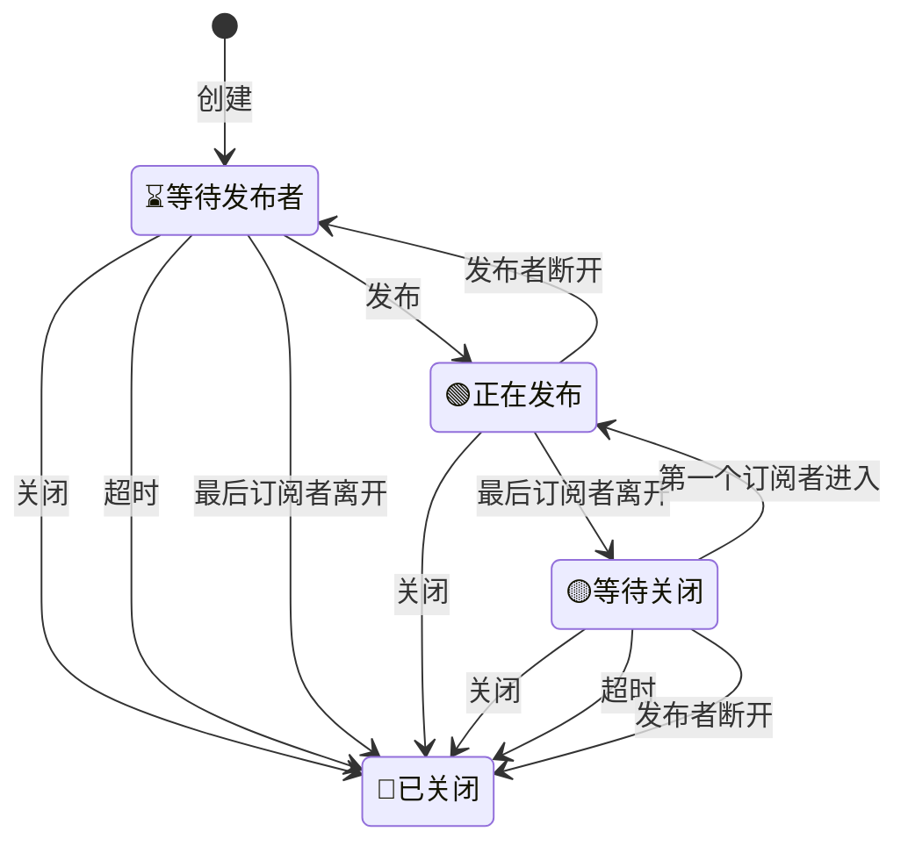

# m7s v4核心引擎

该项目为m7s的引擎部分，该部分逻辑是流媒体服务器的核心转发逻辑。包含了一个插件的引入机制，其他功能均由插件实现

# 引擎的基本功能
- 引擎初始化会加载配置文件，引入的插件会自动注册到引擎中
- 配置文件中配置会被解析并覆盖插件的默认配置
- 引擎提供配置热更新机制（具体热更新逻辑由插件实现）
- 读取插件的特殊方法，将其注册为可供HTTP访问的API接口
- 具有发布功能的插件，可以将流注入到引擎中
- 具有订阅功能的插件，可以从引擎中订阅到流
- 引擎会将流中的数据放入RingBuffer中缓存，以便插件可以获取数据
- 引擎提供了从远端拉流和以及向远端推流的基础框架
- 引擎包了zap日志框架
- 引擎提供事件总线机制，可以对所有插件广播事件
## 引擎自带HTTP接口
- 获取某一个流的详情 `/api/stream?streamPath=xxx`
- 终止某一个流 `/api/closeStream?streamPath=xxx`
- 获取engine信息 `/api/sysInfo` 返回值{Version:xxx,StartTime:xxx,IP:[xxx.xxx.xxx.xxx]}
- 获取系统基本情况 `/api/summary` 返回值Summary数据
- 获取所有插件信息 `/api/plugins` 返回值Plugin数据
- 获取指定的配置信息 `/api/getconfig?name=xxx` 返回xxx插件的配置信息，如果不带参数或参数为空则返回全局配置
- 修改并保存配置信息 `/api/modifyconfig?name=xxx` 修改xxx插件的配置信息,在请求的body中传入修改后的配置json字符串
- 热更新配置信息 `/api/updateconfig?name=xxx` 热更新xxx插件的配置信息，如果不带参数或参数为空则热更新全局配置
- 获取所有远端拉流信息 `/api/list/pull` 返回{RemoteURL:"",StreamPath:"",Type:"",StartTime:""}
- 获取所有向远端推流信息 `/api/list/push` 返回{RemoteURL:"",StreamPath:"",Type:"",StartTime:""}
# 引擎默认配置
```yaml
global:
  loglevel: info # 日志级别，可选值：debug,info,warn,error,panic,fatal
  http:
    # 网关地址，用于访问API
    listenaddr: :8080
    # 用于HTTPS方式访问API的端口配置
    listenaddrtls: ""
    certfile: ""
    keyfile: ""
    # 是否自动添加cors头
    cors: true
    # 用户名和密码，用于API访问时的基本身份认证
    username: ""
    password: ""
  publish:
      # 是否发布音频流
      pubaudio: true
      # 是否发布视频流
      pubvideo: true
      # 剔出已经存在的发布者，用于顶替原有发布者
      kickexist: false
      # 发布流默认过期时间单位秒，超过该时间发布者没有恢复流将被删除
      publishtimeout: 10
      # 自动关闭触发后延迟的秒数(期间内如果有新的订阅则取消触发关闭)，0为关闭该功能，保持连接。
      delayclosetimeout: 0
      # 发布者断开后等待时间，超过该时间发布者没有恢复流将被删除，0为关闭该功能，由订阅者决定是否删除
      waitclosetimeout: 0
  subscribe:
      # 是否订阅音频流
      subaudio: true
      # 是否订阅视频流
      subvideo: true
      # 只订阅关键帧
      iframeonly: false
      # 等待发布者的秒数，用于订阅尚未发布的流
      waittimeout: 10
  # 启用RTP包乱序重排
  rtpreorder : false
  # 启用AVCC格式缓存，用于rtmp协议
  enableavcc : true
  # 启用rtp格式缓存，用于rtsp、websocket、gb28181协议
  enablertp : true
  # rtp乱序重排缓存长度
  rtpreroderbufferlen: 50 
  console: 
    # 连接远程控制台的地址
    server : wss://console.monibuca.com/ws/v1
    # 远程控制台的秘钥
    secret: ""
    # 实例公网地址，提供远程控制台访问的地址，不配置的话使用自动识别的地址
    publicaddr: ""
    # 实例公网地址，提供远程控制台访问的地址，不配置的话使用自动识别的地址（https）
    publicaddrtls: ""
```

# 配置覆盖机制
- 如果不存在配置文件，将使用默认配置，该配置值为代码中写死的配置值
- 如果存在配置文件，则使用配置文件中的值覆盖默认值
- http、publish、subscribe三个配置遵循优先级顺序
1. 如果发布流或者订阅流中包含对应的参数，则优先使用
2. 其次，查找对应插件的配置项中是否包含配置项
3. 最后，使用全局配置中的配置

# 流的状态图
