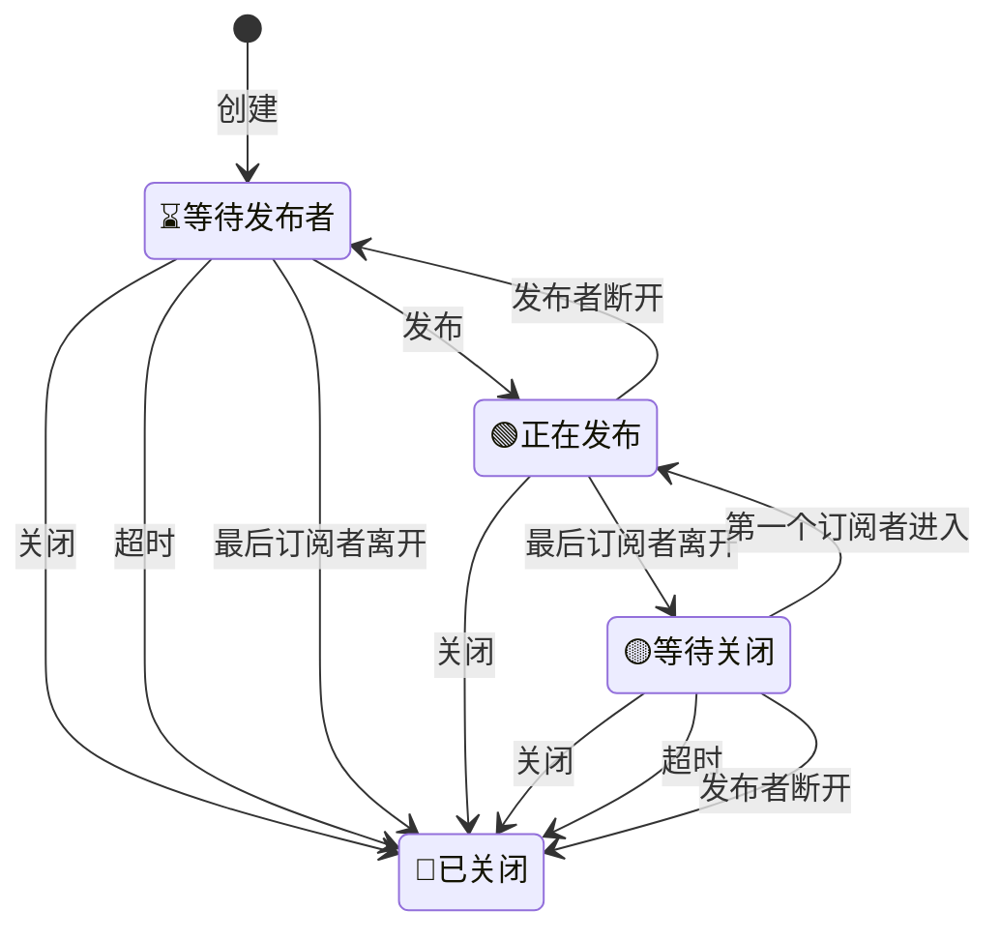

# m7s核心引擎

该项目为m7s的引擎部分，该部分逻辑是流媒体服务器的核心转发逻辑。仅包含最基础的功能，不含任何网络协议部分，但包含了一个插件的引入机制，其他功能均由插件实现

# 引擎配置
```toml
[Engine]
EnableAudio = true
EnableVideo = true
# 发布流默认过期时间单位秒
PublishTimeout = 60
# 自动关闭触发后延迟的秒数(期间内如果有新的订阅则取消触发关闭)
AutoCloseDelay = 10
# 启用RTP包乱序重排
RTPReorder = false
```
# 流的状态图

# 引擎的基本功能
- 引擎初始化会加载配置文件，并逐个调用插件的Run函数
- 具有发布功能的插件，新建一个Stream对象，这个Stream对象随后可以被订阅
- Stream对象中含有两个列表，一个是VideoTracks一个是AudioTracks用来存放视频数据和音频数据
- 每一个VideoTrack或者AudioTrack中包含一个RingBuffer，用来存储发布者提供的数据，同时提供订阅者访问。
- 具有订阅功能的插件，会通过GetStream函数获取到一个流，然后选择VideoTracks、AudioTracks里面的RingBuffer进行连续的读取

# 发布插件如何发布流

以rtmp协议为例子
```go
stream = &engine.Stream{Type: "RTMP", StreamPath: streamPath}
if stream.Publish() {
  absTs := make(map[uint32]uint32)
  vt := stream.NewVideoTrack(0)
  at := stream.NewAudioTrack(0)
  rec_audio = func(msg *Chunk) {
    if msg.ChunkType == 0 {
      absTs[msg.ChunkStreamID] = 0
    }
    if msg.Timestamp == 0xffffff {
      absTs[msg.ChunkStreamID] += msg.ExtendTimestamp
    } else {
      absTs[msg.ChunkStreamID] += msg.Timestamp
    }
    at.PushByteStream(absTs[msg.ChunkStreamID], msg.Body)
  }
  rec_video = func(msg *Chunk) {
    if msg.ChunkType == 0 {
      absTs[msg.ChunkStreamID] = 0
    }
    if msg.Timestamp == 0xffffff {
      absTs[msg.ChunkStreamID] += msg.ExtendTimestamp
    } else {
      absTs[msg.ChunkStreamID] += msg.Timestamp
    }
    vt.PushByteStream(absTs[msg.ChunkStreamID], msg.Body)
  }
  err = nc.SendMessage(SEND_STREAM_BEGIN_MESSAGE, nil)
  err = nc.SendMessage(SEND_PUBLISH_START_MESSAGE, newPublishResponseMessageData(nc.streamID, NetStream_Publish_Start, Level_Status))
} else {
  err = nc.SendMessage(SEND_PUBLISH_RESPONSE_MESSAGE, newPublishResponseMessageData(nc.streamID, NetStream_Publish_BadName, Level_Error))
}
```
默认会创建一个VideoTrack和一个AudioTrack
当我们接收到数据的时候就可以朝里面填充物数据了

在填充数据之前，需要获取到SPS和PPS，然后设置好，因为订阅者需要先发送这个数据
然后通过Track到Push函数将数据填充到RingBuffer里面去

# 订阅插件如何订阅流

```go
sub := Subscriber{ID: r.RemoteAddr, Type: "FLV", Ctx2: r.Context()}
if err := sub.Subscribe(stringPath); err == nil {
  vt, at := sub.WaitVideoTrack(), sub.WaitAudioTrack()
  var buffer bytes.Buffer
  if _, err := amf.WriteString(&buffer, "onMetaData"); err != nil {
    return
  }
  if vt != nil {
    codec.WriteFLVTag(w, codec.FLV_TAG_TYPE_VIDEO, 0, vt.ExtraData.Payload)
    sub.OnVideo = func(ts uint32, pack *VideoPack) {
      codec.WriteFLVTag(w, codec.FLV_TAG_TYPE_VIDEO, ts, pack.Payload)
    }
  }
  if at != nil {
    if at.CodecID == 10 {
      codec.WriteFLVTag(w, codec.FLV_TAG_TYPE_AUDIO, 0, at.ExtraData)
    }
    sub.OnAudio = func(ts uint32, pack *AudioPack) {
      codec.WriteFLVTag(w, codec.FLV_TAG_TYPE_AUDIO, ts, pack.Payload)
    }
  }
  sub.Play(at, vt)
}
```
- 在发送数据前，需要先发送音视频的序列帧