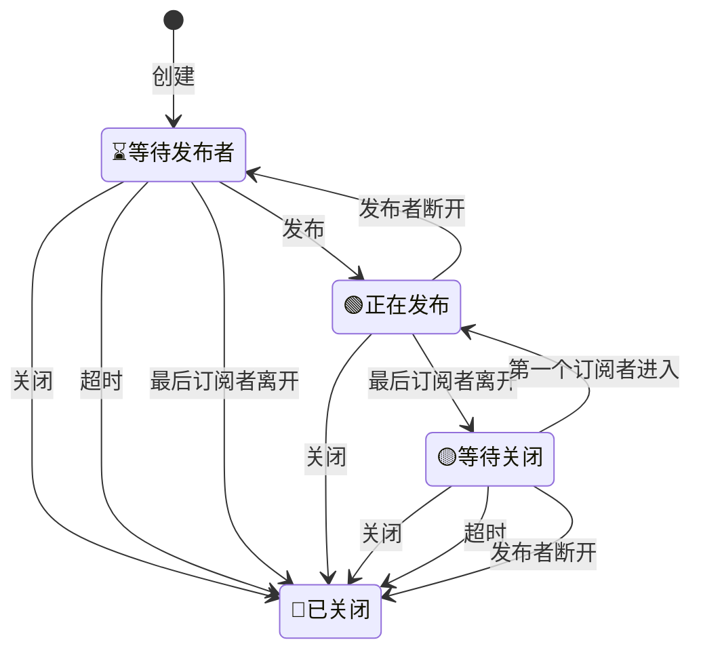

# m7s v4核心引擎

该项目为m7s的引擎部分，该部分逻辑是流媒体服务器的核心转发逻辑。包含了一个插件的引入机制，其他功能均由插件实现

# 引擎的基本功能
- 提供插件机制，对插件的启动，配置解析，事件派发等进行统一管理
- 提供H264、H265、AAC、G711格式的转发
- 提供可复用的AVCC格式、RTP格式、AnnexB格式、ADTS格式等预封装机制
- 提供多Track机制，支持大小流，加密流扩展
- 提供DataTrack机制，可用于实现房间文字聊天等功能
- 提供时间戳同步机制，限速机制
- 提供RTP包乱序重排机制
- 提供订阅者追帧跳帧机制
- 提供发布订阅对外推拉的基础架构
- 提供鉴权机制的底层架构支持
- 提供内存复用机制
- 提供发布者断线重连机制
- 提供按需拉流机制
- 提供HTTP服务端口公用机制
- 提供HTTP API接口自动注册机制
- 提供HTTP接口中间件机制
- 提供结构化日志
- 提供流信息统计和输出
- 提供事件总线机制，可以对所有插件广播事件
- 提供配置热更新机制
## 引擎自带HTTP接口
- 获取某一个流的详情 `/api/stream?streamPath=xxx`
- 终止某一个流 `/api/closestream?streamPath=xxx`
- 获取engine信息 `/api/sysInfo` 返回值{Version:xxx,StartTime:xxx,IP:[xxx.xxx.xxx.xxx]}
- 获取系统基本情况 `/api/summary` 返回值Summary数据
- 获取所有插件信息 `/api/plugins` 返回值Plugin数据
- 读取mp4文件再次发布为视频流 `/api/replay/mp4?streamPath=xxx&dump=filepath`  filepath是文件路径
- 读取ts文件再次发布为视频流 `/api/replay/ts?streamPath=xxx&dump=filepath`  filepath是文件路径
- 获取指定的配置信息 `/api/getconfig?name=xxx` 返回xxx插件的配置信息，如果不带参数或参数为空则返回全局配置
- 修改并保存配置信息 `/api/modifyconfig?name=xxx&yaml=1` 修改xxx插件的配置信息,在请求的body中传入修改后的配置yaml字符串
- 热更新配置信息 `/api/updateconfig?name=xxx` 热更新xxx插件的配置信息，如果不带参数或参数为空则热更新全局配置
- 获取所有远端拉流信息 `/api/list/pull` 返回{RemoteURL:"",StreamPath:"",Type:"",StartTime:""}
- 获取所有向远端推流信息 `/api/list/push` 返回{RemoteURL:"",StreamPath:"",Type:"",StartTime:""}
- 停止推流 `/api/stop/push?url=xxx` 停止向xxx推流 ，成功返回ok
- 停止某个订阅者 `/api/stop/subscribe?streamPath=xxx&id=xxx` 停止xxx流的xxx订阅者 ，成功返回ok
# 引擎默认配置
```yaml
global:
  disableall: false # 是否禁用所有插件
  loglang: zh # 日志语言，可选值：zh,en
  loglevel: info # 日志级别，可选值：debug,info,warn,error,panic,fatal
  http:
    listenaddr: :8080 # 网关地址，用于访问API
    listenaddrtls: :8443  # 用于HTTPS方式访问API的端口配置
    certfile: ""
    keyfile: ""
    cors: true  # 是否自动添加cors头
    username: ""  # 用户名和密码，用于API访问时的基本身份认证
    password: ""
    readtimeout: 0 # 读取超时时间，0为不限制
    writetimeout: 0 # 写入超时时间，0为不限制
    idletimeout: 0 # 空闲超时时间，0为不限制
  publish:
      pubaudio: true # 是否发布音频流
      pubvideo: true # 是否发布视频流
      kickexist: false # 剔出已经存在的发布者，用于顶替原有发布者
      publishtimeout: 10s # 发布流默认过期时间，超过该时间发布者没有恢复流将被删除
      delayclosetimeout: 0 # 自动关闭触发后延迟的时间(期间内如果有新的订阅则取消触发关闭)，0为关闭该功能，保持连接。
      waitclosetimeout: 0 # 发布者断开后等待时间，超过该时间发布者没有恢复流将被删除，0为关闭该功能，由订阅者决定是否删除
      buffertime: 0 # 缓存时间，用于时光回溯，0为关闭缓存
      idletimeout: 0 # 空闲超时时间，0为不限制
      speedlimit: 500ms # 限速超时时间 0为不限速，对于读取文件这类流需要限速，否则读取过快（如果流的时间戳不正确，则只能关闭该功能：设置为0）
      key:                      # 发布鉴权key
	    secretargname: secret     # 发布鉴权参数名
	    expireargname:   expire   # 发布鉴权失效时间参数名
  subscribe:
      subaudio: true # 是否订阅音频流
      subvideo: true # 是否订阅视频流
      subaudioargname: ats # 订阅音频轨道参数名
      subvideoargname: vts # 订阅视频轨道参数名
      subdataargname: dts # 订阅数据轨道参数名
      subaudiotracks: [] # 订阅音频轨道名称列表
      subvideotracks: [] # 订阅视频轨道名称列表
      submode: 0 # 订阅模式，0为跳帧追赶模式，1为不追赶（多用于录制），2为时光回溯模式
      syncmode: 0 # 音视频同步模式，0按照时间戳同步，1按照写入时间同步（在时间戳不正确的时候)
      iframeonly: false # 只订阅关键帧
      waittimeout: 10s # 等待发布者的超时时间，用于订阅尚未发布的流
      writebuffersize: 0 # 订阅者写缓存大小，用于减少io次数，但可能影响实时性
      key:                      # 订阅鉴权key
	    secretargname: secret     # 订阅鉴权参数名
	    expireargname:   expire   # 订阅鉴权失效时间参数名
      internal: false # 是否内部订阅，内部订阅不会触发发布者自动断开功能
  enableavcc : true  # 启用AVCC格式缓存，用于rtmp协议
  enablertp : true # 启用rtp格式缓存，用于rtsp、websocket、gb28181协议
  enableauth: true # 启用鉴权,详细查看鉴权机制
  enablesubevent: true # 启用订阅事件，用于订阅者上下线事件,关闭可以提高性能
  rtpreoderbufferlen: 50 # rtp乱序重排缓存长度
  eventbussize: 10 # 事件总线缓存大小，事件较多时容易堵阻塞线程，需要增大缓存
  poolsize: 0 # 内存池大小，0为不使用内存池
  pulseinterval: 5s # 心跳事件间隔时间
  console: 
    server : console.monibuca.com:44944 # 连接远程控制台的地址
    secret: "" # 远程控制台的秘钥
    publicaddr: "" # 实例公网地址，提供远程控制台访问的地址，不配置的话使用自动识别的地址
    publicaddrtls: "" # 实例公网地址，提供远程控制台访问的地址，不配置的话使用自动识别的地址（https）
```

# 配置覆盖机制
- 如果不存在配置文件，将使用默认配置，该配置值为代码中写死的配置值
- 如果存在配置文件，则使用配置文件中的值覆盖默认值
- http、publish、subscribe三个配置遵循优先级顺序
1. 如果发布流或者订阅流中包含对应的参数，则优先使用
2. 其次，查找对应插件的配置项中是否包含配置项
3. 最后，使用全局配置中的配置

# 流的状态图


# 鉴权机制
## 默认鉴权

在publish 和 subscribe 中配置 key 引擎会自动进行鉴权,
推流或者拉流时需要在url中添加参数 secret=xxx&expire=xxx。

- secret为鉴权前面，MD5(key+StreamPath+expire)
- expire为鉴权失效时间，格式是十六进制 UNIX 时间戳

### 时间戳计算
```
设置时间：2018.12.01 08:30:00
十进制 UNIX 时间戳：1543624200
十六进制 UNIX 时间戳：5C01D608（云直播鉴权配置使用十六进制 UNIX 时间戳，十六进制不区分字母大小写）
```
### 鉴权签名计算
```
secret = MD5(key+StreamPath+expire) 
secret = MD5(ngoeiq03+test/01+5C01D608)
secret = MD5(ngoeiq03test/015C01D608)
secret = ce797dc6238156d548ef945e6ad1ea20
```

## 单独鉴权

如果需要自定义鉴权，可以在插件中实现鉴权接口，
引擎中定义如下两个接口，插件中的发布者或者订阅者可以实现这两个接口，引擎会在发布或者订阅时调用这两个接口进行鉴权
```go
type AuthSub interface {
	OnAuth(*util.Promise[ISubscriber]) error
}

type AuthPub interface {
	OnAuth(*util.Promise[IPublisher]) error
}
```
- OnAuth返回错误即鉴权失败
- Promise方便异步鉴权，可以后续调用其Resolve或Reject方法进行鉴权结果的返回

## 全局鉴权

自定义鉴权也可以全局生效，
引擎中定义如下两个全局函数的变量，插件中可以对这两个变量进行赋值，引擎会在发布或者订阅时调用这两个接口进行鉴权
```go
var OnAuthSub func(p *util.Promise[ISubscriber]) error
var OnAuthPub func(p *util.Promise[IPublisher]) error
```
** 注意：如果单独鉴权和全局鉴权同时存在，优先使用单独鉴权 **
** 全局鉴权函数可以被多次覆盖，所以需要自己实现鉴权逻辑的合并 **

# Http中间件
在HTTPConfig接口中增加了AddMiddleware方法，可以通过该方法添加中间件，中间件的定义如下
```go
type Middleware func(string, http.Handler) http.Handler
type HTTPConfig interface {
	GetHTTPConfig() *HTTP
	Listen(ctx context.Context) error
	Handle(string, http.Handler)
	AddMiddleware(Middleware)
}

```
中间件的添加必须在FirstConfig之前，也就是在Listen之前
例如：
```go
type MyMiddlewareConfig struct {
  	config.HTTP
}
var myMiddlewareConfig = &MyMiddlewareConfig{}
func init(){
  myMiddlewareConfig.AddMiddleware(func(pattern string, handler http.Handler) http.Handler {
    return http.HandlerFunc(func(w http.ResponseWriter, r *http.Request) {
      // do something
      handler.ServeHTTP(w, r)
    })
  })
}
```